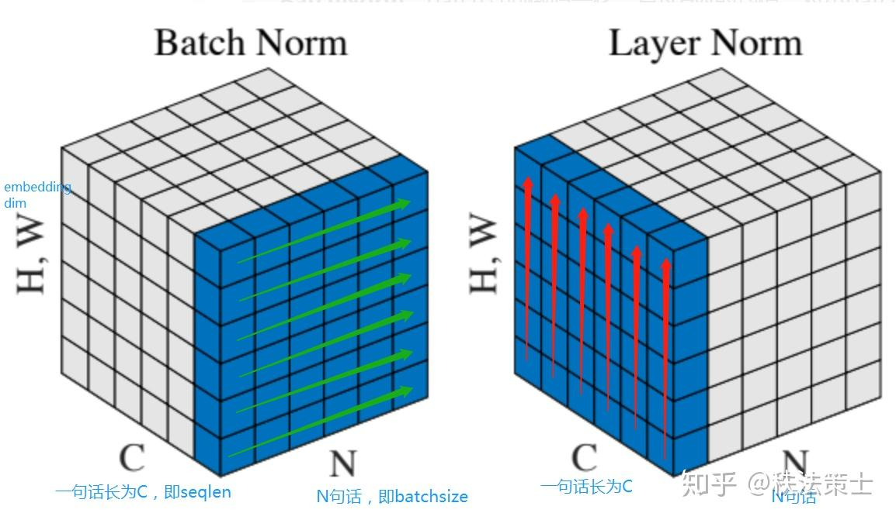

Normalization公式如下
$$
y=\frac{x-E[x]}{\sqrt{Var[x]+\epsilon}} \star \gamma + \beta
$$
## 1.Batch Normalization 与 Layer Normalization

主要区别：

Normalization方向不同，BN是一种“列缩放”，LN是一种“行缩放”

BN处理的对象是一批样本，是对这一批样本的同一维度做归一化。BN的目的是让每一层的分布稳定下来。

LN处理的对象是单个样本，是对当个样本的所有维度特征做归一化。在NLP中，LN一般用在第三维度，即[batch_size, seq_len, emb_dims]中的emb_dims，一般是词向量的维度。

## 2.为何要做Norm

本质上是对一批不太标准的数据统一到指定的格式。

一方面，激活函数由一定的饱和性，网络深度增加，每层特征分布会逐项偏向输出区间的两端靠近，可能会导致梯度消失。

另一方面，机器学习领域由很重要的假设：IID（即独立同分布）。归一化可以避免数据分布不同对模型的影响

## 3.为何NLP中用LN多，CV中用BN多？

NLP中的LN是对每个词的embedding做Norm，BN是对batch中相同位置词的embedding词做norm

1. BN对同一位置的词做归一化，破坏了一句话中每个词的联系。
2. LN有助于得到一个空间，BN不具备这样的功能。
3. BN对batch_size比较敏感。
4. 存在padding问题，长度不一致BN会有问题。

## 4.NLP与CV任务差别：

CV数据是客观存在的，像素本身已经包含了“信息”。

NLP数据从embedding开始的，这个embedding是学出来的，不是客观存在的。通过LN得到的embedding是以原点为中心，1为标准差，越往外越稀疏的球体空间。

## 3.参考

1. https://zhuanlan.zhihu.com/p/74516930
2. https://zhuanlan.zhihu.com/p/113233908
3. https://blog.csdn.net/HUSTHY/article/details/106665809
